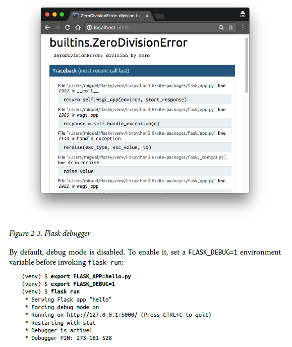
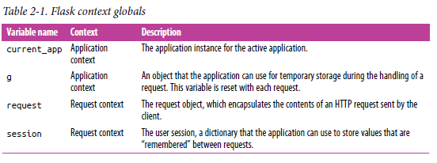
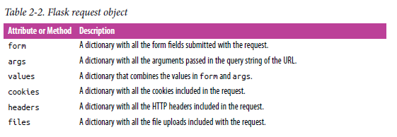
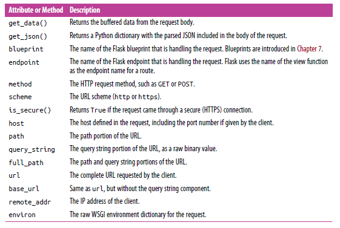
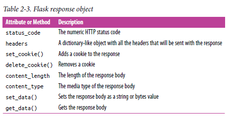
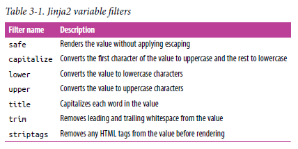

# Flask Web Development

## Part I. Introduction to Flask

### 1. Installation
### 2. Basic Application Structure
### 3. Templates
### 4. Web Forms
### 5. Databases
### 6. Email
### 7. Large Application Structure

## Part II. Example: A Social Blogging Application

### 8. User Authentication
### 9. User Roles
### 10. User Profiles
### 11. Blog Posts
### 12. Followers
### 13. User Comments
### 14. Application Programming Interfaces

## Part III. The Last Mile

### 15. Testing
### 16. Performance
### 17. Deployment
### 18. Additional Resources

---
---

# Part I. Introduction to Flask

# 1. Installation

\-

# 2. Basic Application Structure

## Initialization

All Flask applications must create an application instance. The web server passes all requests it receives from clients to this object for handling, using a protocol called Web Server Gateway Interface (WSGI, pronounced “wiz-ghee”). The application instance is an object of class Flask, usually created as follows:

```python
from flask import Flask
app = Flask(__name__)
```

The only required argument to the Flask class constructor is the name of the main module or package of the application. For most applications, Python’s __name__ variable is the correct value for this argument.

## Routes and View Functions

Clients such as web browsers send requests to the web server, which in turn sends them to the Flask application instance. The Flask application instance needs to know what code it needs to run for each URL requested, so it keeps a mapping of URLs to Python functions. The association between a URL and the function that handles it is called a route.

The most convenient way to define a route in a Flask application is through the app.route decorator exposed by the application instance. The following example shows how a route is declared using this decorator:

```python
@app.route('/')
def index():
    return '<h1>Hello World!</h1>'
```

Decorators are a standard feature of the Python language. A common use of decorators is to register functions as handler functions to be invoked when certain events occur.

The previous example registers function index() as the handler for the application’s root URL. While the app.route decorator is the preferred method to register view functions, Flask also offers a more traditional way to set up the application routes with the app.add_url_rule() method, which in its most basic form takes three arguments: the URL, the endpoint name, and the view function. The following example uses app.add_url_rule() to register an index() function that is equivalent to the one shown previously:

```python
def index():
    return '<h1>Hello World!</h1>'

app.add_url_rule('/', 'index', index)
```

Functions like index() that handle application URLs are called view functions. If the application is deployed on a server associated with the www.example.com domain name, then navigating to http://www.example.com/ in your browser would trigger index() to run on the server. The return value of this view function is the response the client receives. If the client is a web browser, this response is the document that is displayed to the user in the browser window. A response returned by a view function can be a simple string with HTML content, but it can also take more complex forms, as you will see later.

If you pay attention to how some URLs for services that you use every day are formed, you will notice that many have variable sections. For example, the URL for your Facebook profile page has the format https://www.facebook.com/<your-name>, which includes your username, making it different for each user. Flask supports these types of URLs using a special syntax in the app.route decorator. The following example defines a route that has a dynamic component:

```python
@app.route('/user/<name>')
def user(name):
    return '<h1>Hello, {}!</h1>'.format(name)
```

The portion of the route URL enclosed in angle brackets is the dynamic part. Any URLs that match the static portions will be mapped to this route, and when the view function is invoked, the dynamic component will be passed as an argument. In the preceding example, the name argument is used to generate a response that includes a personalized greeting.

The dynamic components in routes are strings by default but can also be of different types. For example, the route /user/<int:id> would match only URLs that have an integer in the id dynamic segment, such as /user/123. Flask supports the types string, int, float, and path for routes. The path type is a special string type that can include forward slashes, unlike the string type.

## Development Web Server

Flask applications include a development web server that can be started with the flask run command. This command looks for the name of the Python script that contains the application instance in the FLASK_APP environment variable.

To start the hello.py application from the previous section, first make sure the virtual environment you created earlier is activated and has Flask installed in it. For Linux and macOS users, start the web server as follows:

```bash
(venv) $ export FLASK_APP=hello.py
(venv) $ flask run
* Serving Flask app "hello"
* Running on http://127.0.0.1:5000/ (Press CTRL+C to quit)
```

## Debug Mode

Flask applications can optionally be executed in debug mode. In this mode, two very convenient modules of the development server called the reloader and the debugger are enabled by default.

When the reloader is enabled, Flask watches all the source code files of your project and automatically restarts the server when any of the files are modified. Having a server running with the reloader enabled is extremely useful during development, because every time you modify and save a source file, the server automatically restarts and picks up the change.

The debugger is a web-based tool that appears in your browser when your application raises an unhandled exception. The web browser window transforms into an interactive stack trace that allows you to inspect source code and evaluate expressions in any place in the call stack. You can see how the debugger looks in Figure 2-3.



## Application and Request Contexts

When Flask receives a request from a client, it needs to make a few objects available to the view function that will handle it. A good example is the request object, which encapsulates the HTTP request sent by the client.

The obvious way in which Flask could give a view function access to the request object is by sending it as an argument, but that would require every single view function in the application to have an extra argument. Things get more complicated if you consider that the request object is not the only object that view functions might need to access to fulfill a request.

To avoid cluttering view functions with lots of arguments that may not always be needed, Flask uses contexts to temporarily make certain objects globally accessible. Thanks to contexts, view functions like the following one can be written:

```python
from flask import request

@app.route('/')
def index():
    user_agent = request.headers.get('User-Agent')
    return '<p>Your browser is {}</p>'.format(user_agent)
```

Note how in this view function, request is used as if it were a global variable. In reality, request cannot be a global variable; in a multithreaded server several threads can be working on different requests from different clients all at the same time, so each thread needs to see a different object in request. Contexts enable Flask to make certain variables globally accessible to a thread without interfering with the other threads.

There are two contexts in Flask: the application context and the request context. Table 2-1 shows the variables exposed by each of these contexts.



Flask activates (or pushes) the application and request contexts before dispatching a request to the application, and removes them after the request is handled. When the application context is pushed, the current_app and g variables become available to the thread. Likewise, when the request context is pushed, request and session become available as well. If any of these variables are accessed without an active application or request context, an error is generated. The four context variables will be covered in detail in this and later chapters, so don’t worry if you don’t understand why they are useful yet.

## Request Dispatching

When the application receives a request from a client, it needs to find out what view function to invoke to service it. For this task, Flask looks up the URL given in the request in the application’s URL map, which contains a mapping of URLs to the view functions that handle them. Flask builds this map using the data provided in the app.route decorator, or the equivalent non-decorator version, app.add_url_rule().

## The Request Object

You have seen that Flask exposes a request object as a context variable named request. This is an extremely useful object that contains all the information that the client included in the HTTP request. Table 2-2 enumerates the most commonly used attributes and methods of the Flask request object.


 

## Request Hooks

Sometimes it is useful to execute code before or after each request is processed. For example, at the start of each request it may be necessary to create a database connection or authenticate the user making the request. Instead of duplicating the code that performs these actions in every view function, Flask gives you the option to register common functions to be invoked before or after a request is dispatched.

Request hooks are implemented as decorators. These are the four hooks supported by Flask:

* ```before_request```
     * Registers a function to run before each request.
* ```before_first_request```
     * Registers a function to run only before the first request is handled. This can be a convenient way to add server initialization tasks.
* ```after_request```
     * Registers a function to run after each request, but only if no unhandled exceptions occurred.
* ```teardown_request```
     * Registers a function to run after each request, even if unhandled exceptions occurred.

A common pattern to share data between request hook functions and view functions is to use the g context global as storage. For example, a before_request handler can load the logged-in user from the database and store it in g.user. Later, when the view function is invoked, it can retrieve the user from there.

## Responses

When Flask invokes a view function, it expects its return value to be the response to the request. In most cases the response is a simple string that is sent back to the client as an HTML page.

But the HTTP protocol requires more than a string as a response to a request. A very important part of the HTTP response is the status code, which Flask by default sets to 200, the code that indicates that the request was carried out successfully.

When a view function needs to respond with a different status code, it can add the numeric code as a second return value after the response text. For example, the following view function returns a 400 status code, the code for a bad request error:

```python
@app.route('/')
def index():
    return ('<h1>Bad Request</h1>', 400)
```

Responses returned by view functions can also take a third argument, a dictionary of headers that are added to the HTTP response. You will see an example of custom response headers in Chapter 14.

Instead of returning one, two, or three values as a tuple, Flask view functions have the option of returning a response object. The make_response() function takes one, two, or three arguments, the same values that can be returned from a view function, and returns an equivalent response object. Sometimes it is useful to generate the response object inside the view function, and then use its methods to further configure the response. The following example creates a response object and then sets a cookie in it:

```python
from flask import make_response

@app.route('/')
def index():
    response = make_response('<h1>This document carries a cookie!</h1>')
    response.set_cookie('answer', '42')
    return response
```

Table 2-3 shows the most commonly used attributes and methods available in response objects.



There is a special type of response called a redirect. This response does not include a page document; it just gives the browser a new URL to navigate to. A very common use of redirects is when working with web forms, as you will learn in Chapter 4.

A redirect is typically indicated with a 302 response status code and the URL to go to given in a Location header. A redirect response can be generated manually with a three-value return or with a response object, but given its frequent use, Flask provides a redirect() helper function that creates this type of response:

```python
from flask import redirect

@app.route('/')
def index():
    return redirect('http://www.example.com')
```

Another special response is issued with the abort() function, which is used for error handling. The following example returns status code 404 if the id dynamic argument given in the URL does not represent a valid user:

```python
from flask import abort

@app.route('/user/<id>')
def get_user(id):
    user = load_user(id)
    
    if not user:
        abort(404)
        
    return '<h1>Hello, {}</h1>'.format(user.name)
```

Note that abort() does not return control back to the function because it raises an exception.

## Flask Extensions

Flask is designed to be extended. It intentionally stays out of areas of important functionality such as database and user authentication, giving you the freedom to select the packages that fit your application the best, or to write your own if you so desire.

A great variety of Flask extensions for many different purposes have been created by the community, and if that is not enough, any standard Python package or library can be used as well.

# 3. Templates

## Introduction

The key to writing applications that are easy to maintain is to write clean and wellstructured code. The examples that you have seen so far are too simple to demonstrate this, but Flask view functions have two completely independent purposes disguised as one, which creates a problem.

The obvious task of a view function is to generate a response to a request, as you have seen in the examples shown in Chapter 2. For the simplest requests this is enough, but in many cases a request also triggers a change in the state of the application, and the view function is where this change is generated.

For example, consider a user who is registering a new account on a website. The user types an email address and a password in a web form and clicks the Submit button. On the server, a request with the data provided by the user arrives, and Flask dispatches it to the view function that handles registration requests. This view function needs to talk to the database to get the new user added, and then generate a response to send back to the browser that includes a success or failure message. These two types of tasks are formally called business logic and presentation logic, respectively.

Mixing business and presentation logic leads to code that is hard to understand and maintain. Imagine having to build the HTML code for a large table by concatenating data obtained from the database with the necessary HTML string literals. Moving the presentation logic into templates helps improve the maintainability of the application.

A template is a file that contains the text of a response, with placeholder variables for the dynamic parts that will be known only in the context of a request. The process that replaces the variables with actual values and returns a final response string is called rendering. For the task of rendering templates, Flask uses a powerful template engine called Jinja2.

## The Jinja2 Template Engine

In its simplest form, a Jinja2 template is a file that contains the text of a response. Example 3-1 shows a Jinja2 template that matches the response of the index() view function of Example 2-1.

```html
<h1>Hello World!</h1>
```

The response returned by the user() view function of Example 2-2 has a dynamic component, which is represented by a variable. Example 3-2 shows the template that implements this response.

```html
<h1>Hello, {{ name }}!</h1>
```

## Rendering Templates

By default Flask looks for templates in a templates subdirectory located inside the main application directory. For the next version of hello.py, you need to create the templates subdirectory and store the templates defined in the previous examples in it as index.html and user.html, respectively.

The view functions in the application need to be modified to render these templates. Example 3-3 shows these changes.

```python
from flask import Flask, render_template
# ...

@app.route('/')
def index():
  return render_template('index.html')
  
@app.route('/user/<name>')
def user(name):
  return render_template('user.html', name=name)
```

The function render_template() provided by Flask integrates the Jinja2 template engine with the application. This function takes the filename of the template as its first argument. Any additional arguments are key-value pairs that represent actual values for variables referenced in the template. In this example, the second template is receiving a name variable.

Keyword arguments like name=name in the previous example are fairly common, but they may seem confusing and hard to understand if you are not used to them. The “name” on the left side represents the argument name, which is used in the placeholder written in the template. The “name” on the right side is a variable in the current scope that provides the value for the argument of the same name. While this is a common pattern, using the same variable name on both sides is not required.

## Variables

The {{ name }} construct used in the template shown in Example 3-2 references a variable, a special placeholder that tells the template engine that the value that goes in that place should be obtained from data provided at the time the template is rendered.

Jinja2 recognizes variables of any type, even complex types such as lists, dictionaries, and objects. The following are some more examples of variables used in templates:

```html
<p>A value from a dictionary: {{ mydict['key'] }}.</p>
<p>A value from a list: {{ mylist[3] }}.</p>
<p>A value from a list, with a variable index: {{ mylist[myintvar] }}.</p>
<p>A value from an object's method: {{ myobj.somemethod() }}.</p>
```

Variables can be modified with filters, which are added after the variable name with a pipe character as separator. For example, the following template shows the name variable capitalized:

```
Hello, {{ name|capitalize }}
```

Table 3-1 lists some of the commonly used filters that come with Jinja2.



The safe filter is interesting to highlight. By default Jinja2 escapes all variables for security purposes. For example, if a variable is set to the value '<h1>Hello</h1>', Jinja2 will render the string as '&lt;h1&gt;Hello&lt;/h1&gt;', which will cause the h1 element to be displayed and not interpreted by the browser. Many times it is necessary to display HTML code stored in variables, and for those cases the safe filter is used.


